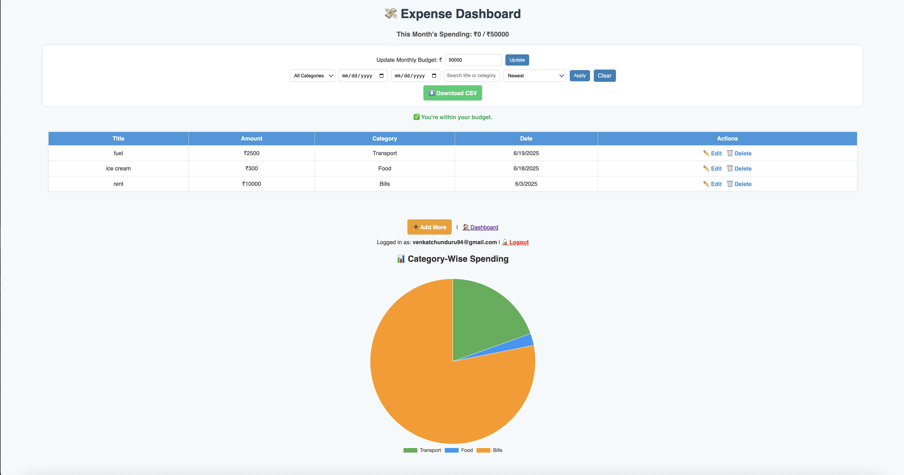
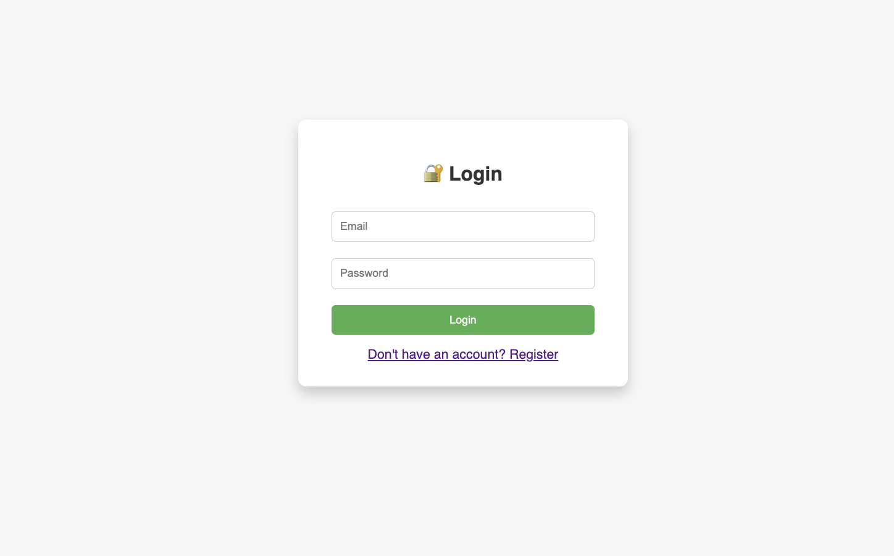

# 💸 Expense Tracker & Budget Monitoring App

A full-stack web application to track your daily expenses, set monthly budgets, and visualize your spending patterns. Built using **Node.js**, **Express**, **MongoDB**, **EJS**, and **Chart.js**.

---

## 🚀 Features

- ✅ User Authentication (Register & Login)
- 💼 Add, Edit, and Delete Expenses
- 📆 Filter by Category & Date Range
- 🔍 Search & Sort by Amount, Date, or Category
- 📊 Pie Chart: Category-wise Monthly Spending (Chart.js)
- 💰 Monthly Budget Tracking with Alerts
- 📁 Export Monthly Expenses as CSV
- 🔐 Session Management using `express-session` and `connect-mongo`

---

## 📸 Screenshots

> Add screenshots in `/screenshots/` and embed them here using markdown:
```md


